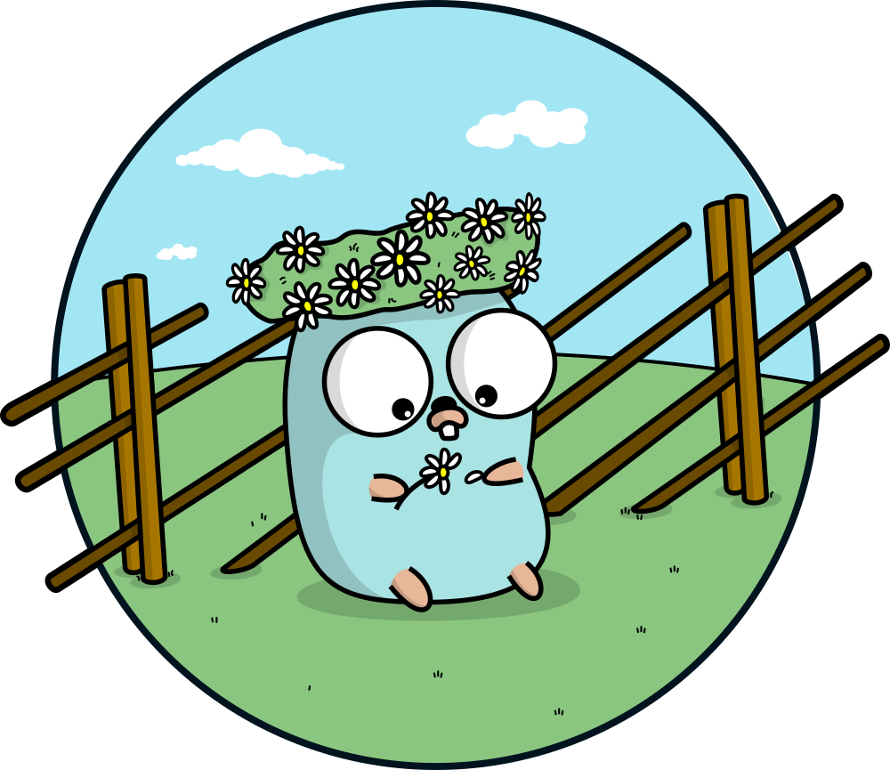

Text can be **bold**, _italic_, or ~~strikethrough~~.

[[other_page|Link to another page]]

[External link](https://github.com/mstcl/pher)

There should be whitespace between paragraphs[^1].

[^1]: I am a footnote

# Header 1

This is a normal paragraph following a header.

## Header 2

Only second level header are shown in the TOC

> This is a blockquote following a header.
>
> When something is important enough, you do it even if the odds are not in your favor.

### Header 3

```js
// Javascript code with syntax highlighting.
var fun = function lang(l) {
  dateformat.i18n = require("./lang/" + l);
  return true;
};
```

```ruby
# Ruby code with syntax highlighting
GitHubPages::Dependencies.gems.each do |gem, version|
  s.add_dependency(gem, "= #{version}")
end
```

#### Header 4 `with code not transformed`

- This is an unordered list following a header.
- This is an unordered list following a header.
- This is an unordered list following a header.

##### Header 5

1. This is an ordered list following a header.
1. This is an ordered list following a header.
1. This is an ordered list following a header.

###### Header 6

[This is a very long link which wraps and therefore doesn't overflow
even when it comes at the beginning](.) of the line.

- [This is a very long link which wraps and therefore doesn't overflow the line
  when used first in an item ](.) in a list.

This is a table:

| head1        | head two          | three |
| :----------- | :---------------- | :---- |
| ok           | good swedish fish | nice  |
| out of stock | good and plenty   | nice  |
| ok           | good `oreos`      | hmm   |
| ok           | good `zoute` drop | yumm  |

### There's a horizontal rule below this.

______________________________________________________________________

### Here is an unordered list:

- Item foo
- Item bar
- Item baz
- Item zip

### And an ordered list:

1. Item one
1. Item two
1. Item three
1. Item four

### And an ordered list, continued:

1. Item one
1. Item two

### And a nested list:

- level 1 item
  - level 2 item
  - level 2 item
    - level 3 item
    - level 3 item
- level 1 item
  - level 2 item
  - level 2 item
  - level 2 item
- level 1 item
  - level 2 item
  - level 2 item
- level 1 item

### And a task list

- [ ] Hello, this is a TODO item
- [ ] Hello, this is another TODO item
- [ ] level 1 item
  - [ ] level 2 item
- [x] Goodbye, this item is done
  - level 2 item
  - level 2 item
- level 1 item
  - [ ] level 2 item (task)
  - [ ] level 2 item (task)

### A gigantic image



Just use HTML to rescale it


### Definition lists can be used with HTML syntax.

<dl>
<dt>Name</dt>
<dd>Godzilla</dd>
<dt>Born</dt>
<dd>1952</dd>
<dt>Birthplace</dt>
<dd>Japan</dd>
<dt>Color</dt>
<dd>Green</dd>
</dl>

### More code

```go
package main

import (
    "fmt"
    "sync"
    "sync/atomic"
)

func main() {

    var ops atomic.Uint64

    var wg sync.WaitGroup

    for i := 0; i < 50; i++ {
        wg.Add(1)

        go func() {
            for c := 0; c < 1000; c++ {

                ops.Add(1)
            }

            wg.Done()
        }()
    }

    wg.Wait()

    fmt.Println("ops:", ops.Load())
}
```

Long, single-line code blocks should not wrap. They should horizontally scroll if they are too long. This line should be long enough to demonstrate this.

### Collapsed Section

The following uses the [`<details>`](https://docs.github.com/en/get-started/writing-on-github/working-with-advanced-formatting/organizing-information-with-collapsed-sections) tag to create a collapsed section.

<details markdown="block">
<summary>Shopping list (click me!)</summary>

This is content inside a `<details>` dropdown.

- [ ] Apples
- [ ] Oranges
- [ ] Milk

</details>
